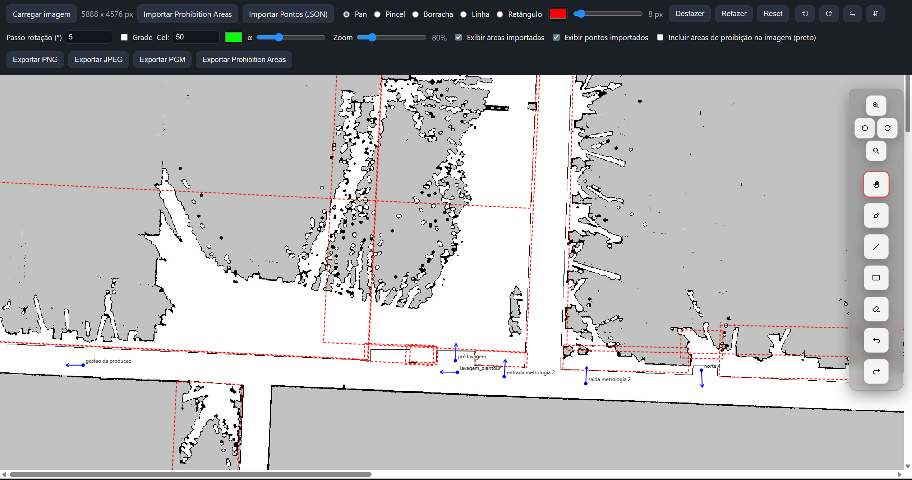

# Editor de Imagem de Mapas

Editor web simples (HTML/CSS/JS puros) para revisar e editar mapas, desenhar Prohibition Areas e exportar imagem e YAML mantendo a resolução original.

## Demonstração

- [Vídeo (YouTube)](https://youtu.be/cCq1yT_o2wM)



## Principais recursos

- Rotação somente visual do mapa (ferramentas continuam funcionais).
- Zoom e pan suaves.
- Ferramentas: Pan, Pincel (vermelho), Linha, Retângulo (alinhado à tela), Borracha.
- Exportação de imagem PNG/JPEG/PGM na resolução original (PGM: P5 8-bit).
- Opção para incluir/excluir o overlay desenhado na imagem exportada; quando incluído, é convertido para preto.
- Exportação de Prohibition Areas (YAML) combinando desenhos em vermelho + áreas importadas (após edições).
- Importação e edição de Prohibition Areas (YAML): selecionar, arrastar para mover e deletar (Delete/Backspace).
- Importação de Pontos (JSON) com seta de orientação e rótulo; toggle de exibição.
- HUD com coordenadas do cursor em metros (x/y) e grade configurável.

## Requisitos

- Navegador moderno (Chrome, Edge, Firefox). Nenhuma instalação adicional é necessária.

Observação: o aplicativo tenta carregar `./map.yaml` via `fetch`. Ao abrir o `index.html` diretamente pelo sistema de arquivos, alguns navegadores podem bloquear a leitura (CORS). Nesse caso, o editor usa valores padrão (resolution 0.025, origin [0,0,0]). Para garantir a leitura do `map.yaml` local, sirva a pasta por um servidor estático.

## Como iniciar

1. Abra `frontend/image-editor/index.html` no navegador.
2. Clique em "Carregar imagem" e selecione o mapa (PNG/JPG/PGM).
3. Opcional: clique em "Importar Prohibition Areas" e selecione um YAML com as áreas (aparecem como sobreposição no HUD e podem ser editadas).
4. Opcional: clique em "Importar Pontos (JSON)" para visualizar pontos com orientação e rótulos.

## Fluxo de trabalho sugerido

1. Carregue a imagem do mapa.
2. Ajuste a visualização com rotacionar/zoom/pan (a rotação é apenas visual).
3. Desenhe Prohibition Areas com o Pincel vermelho, Linha ou Retângulo (retângulo é alinhado à tela; segure Shift para quadrado).
4. (Opcional) Importe Prohibition Areas (YAML) para comparar/ajustar; selecione, arraste para mover, ou delete.
5. (Opcional) Importe Pontos (JSON) para referência visual (seta de orientação + rótulo).
6. Exporte:
   - Imagem (PNG/JPEG/PGM) preservando a resolução original.
   - Prohibition Areas (YAML) combinando as áreas importadas editadas e os desenhos em vermelho.

## Ferramentas

- Pan (mover): ferramenta padrão ao iniciar.
- Pincel (vermelho): cria áreas livres à mão; somente vermelho é considerado funcional para exportar YAML.
- Borracha: remove partes desenhadas.
- Linha: desenha segmentos em vermelho (selecione vermelho) que entram no YAML.
- Retângulo (alinhado à tela): desenha retângulos sempre horizontais/verticais na tela, independente da rotação visual. Segure Shift para forçar quadrado.

## Rotação e Zoom

- Rotação: botões giram a visualização, não a imagem original.
- Zoom: controle deslizante ou botões.
- Exportação de imagem sempre ignora a rotação visual e mantém a orientação original.

## Importação e Exportação

### Imagem

- PNG/JPEG/PGM na resolução original da imagem importada (PGM exporta em P5, 8 bits).
- Fundo cinza (#cdcdcd) é aplicado onde não há conteúdo.
- Checkbox "Incluir áreas de proibição na imagem (preto)":
  - Desmarcado: o overlay desenhado (vermelho) não é incluído.
  - Marcado: inclui o overlay desenhado convertendo-o para preto (mantendo a transparência).
  - Observação: áreas importadas e pontos JSON são desenhados apenas no HUD e não entram na imagem exportada.

### Prohibition Areas (YAML)

- Exportação: gera `prohibition_areas.yaml` com vértices em metros, usando `resolution`, `origin` e `yaw` do `map.yaml` local (ou defaults). O arquivo exportado combina as áreas importadas (após edições de mover/deletar) com os desenhos feitos em vermelho.
- Importação: sobrepõe as áreas do arquivo selecionado no HUD e permite edição básica (selecionar, arrastar/mover a área inteira e deletar com Delete/Backspace).

Formato compatível (exemplo):

```yaml
prohibition_areas:
  - [[1.23, 0.50], [2.10, 0.50]]
  - [[-0.5, -0.5], [0.5, -0.5], [0.5, 0.5], [-0.5, 0.5]]
```

Cada item deve estar em uma única linha com pontos no formato `[x, y]` (o exportador segue esse padrão).

### Pontos (JSON)

- Importa um arquivo `.json` com chave raiz `points`:
  - Campos aceitos por ponto: `dbname` (ou `name`), `dbx` (ou `x`), `dby` (ou `y`) e `dborientation` (ou `yaw`/`theta`, em graus).
- Os pontos são exibidos no HUD como círculo + seta de orientação e rótulo; há um toggle para exibir/ocultar.
- Os pontos são apenas para referência visual; não são incluídos nas exportações de imagem nem no YAML.

## Metadados do mapa (map.yaml)

- O editor tenta ler `./map.yaml` automaticamente. Se falhar, usa `resolution: 0.025` e `origin: [0,0,0]`.
- Para conversões corretas (pixel↔mundo), a imagem carregada deve corresponder ao `map.yaml` (mesma resolução e dimensões do mapa).

## Limitações conhecidas

- Apenas a cor vermelha (`#ff0000`) é considerada funcional para exportar áreas (YAML).
- Importação de áreas espera cada polilinha/polígono em uma única linha no YAML (mesmo padrão do export).
- Áreas importadas e pontos JSON não são incluídos na imagem exportada (apenas o overlay desenhado pode ser incluído, se marcado).
- Pontos (JSON) não são exportados (imagem ou YAML).
- Flip horizontal/vertical afeta a imagem (não é apenas visual); rotação é apenas visual e não altera a exportação.

## Dicas
- Use a rotação visual para alinhar melhor a visão antes de desenhar retângulos alinhados à tela.
- Ative/desative a exibição das áreas importadas para comparar o mapa atual com o mapa de outro robô.

---
Qualquer ajuste extra (atalhos, novos formatos, inclusão das áreas importadas na imagem exportada, etc.) pode ser adicionada conforme necessidade.
